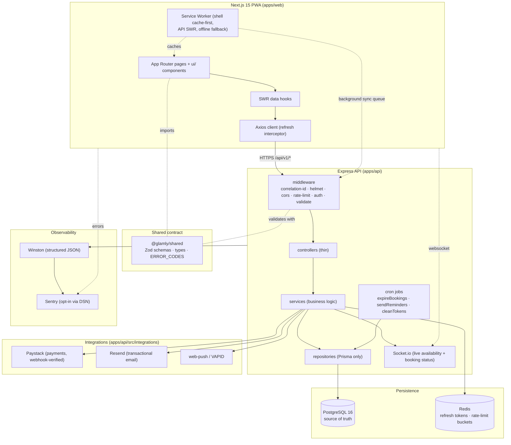

# Glamly — System Architecture

> A beauty & booking marketplace for the Nigerian market, delivered as an installable
> PWA over a REST API. This document explains **how the system is shaped and why**.
> It complements the engineering constitution in [`/CLAUDE.md`](../CLAUDE.md) and the
> Architecture Decision Records in [`docs/adr/`](./adr). Where a decision has a
> dedicated ADR it is linked; the rest are summarized here.

---

## 1. The big picture

Glamly is a **TypeScript monorepo** (pnpm workspaces + Turborepo). The only contract
between the client and server is the `shared` package (Zod schemas, types, error-code
taxonomy) and HTTP. Neither app imports the other's code.



**Why a monorepo.** One repo, one PR, one CI run keeps the shared Zod contract honest:
a schema change fails the build on *both* sides at once, so the client and server can
never silently drift. Turborepo caches typecheck/lint/test/build per package.

---

## 2. Repository layout

```
glamly/
├── apps/
│   ├── web/   → Next.js 15 App Router PWA (route groups: (public) (auth) (protected) (stylist))
│   └── api/   → Express REST API (routes → controllers → services → repositories)
├── packages/
│   ├── shared/  → Zod schemas, types, constants, ERROR_CODES (imported by BOTH apps)
│   └── config/  → shared ESLint + tsconfig presets
├── infrastructure/ → Docker, db init
└── docs/        → this file, ADRs, setup, audit report
```

---

## 3. Backend layering (and why it is non-negotiable)

Every request flows through one-job-each layers:

```
HTTP → routes (wiring) → middleware (auth/role/validate/rate-limit)
     → controllers (parse + shape, THIN) → services (ALL business logic)
     → repositories (ONLY place Prisma runs) → PostgreSQL
```

- **Controllers stay thin; services hold the logic.** Services import no `express`,
  `req`, or `res`, so they are unit-testable in isolation and reusable from cron jobs
  (e.g. `sendReminders` calls the same notification service as a request path).
- **Repositories are the only files that touch `prisma.*`.** Persistence is swappable
  and query patterns (N+1, indexes) live in one reviewable place.
- **Third-party APIs sit behind `integrations/` wrappers** (Paystack, Resend,
  web-push) so they can be mocked in tests and swapped without touching logic.

### Request lifecycle

```mermaid
sequenceDiagram
  participant C as Client (Axios)
  participant M as Middleware
  participant Ctrl as Controller
  participant S as Service
  participant R as Repository
  participant DB as Postgres/Redis
  C->>M: HTTP + (optional) x-request-id
  M->>M: assign/echo correlation id (AsyncLocalStorage)
  M->>M: helmet · cors allowlist · rate-limit (Redis) · auth · Zod validate
  M->>Ctrl: validated, typed input
  Ctrl->>S: call (no business logic here)
  S->>R: read/write (transaction if multi-table)
  R->>DB: parameterized query
  DB-->>S: rows
  S-->>Ctrl: domain result / throws AppError
  Ctrl-->>C: { success, data } or errorHandler maps AppError → { success:false, error:{code} }
  Note over M,Ctrl: every log line carries the correlation id;<br/>unexpected errors → Sentry + 500 (no stack leak)
```

---

## 4. Key decisions & the "why"

| Decision | Why | Reference |
|---|---|---|
| **JWT (access + refresh) over server sessions** | Stateless access tokens scale horizontally; refresh tokens are rotated and **revocable in Redis** (logout/compromise). Access in memory, refresh in an `HttpOnly` cookie scoped to `/api/v1/auth`. | [ADR 0001](./adr/0001-authentication-and-session-management.md) |
| **PostgreSQL + Prisma** | Bookings/payments are relational and need transactions + unique constraints (no double-booking). Prisma parameterizes every query (SQL-injection-safe) and keeps migrations reviewed & forward-only. | _ADR TODO_ |
| **Redis for refresh tokens & rate limits** | Refresh-token revocation needs a fast, shared, expiring store; rate-limit buckets must be **shared across instances** (in-memory buckets let N pods each allow the full quota). | §2 below |
| **Zod schemas in `shared`** | One schema validates at the HTTP boundary (server) *and* powers client forms — the contract can't drift. | — |
| **Paystack, webhook-verified** | Payment state is **never client-trusted**: a booking is only CONFIRMED by a signature-verified `charge.success` webhook, idempotent by event id. | _ADR TODO_ |
| **Socket.io** | Live availability + booking-status changes need server push; Socket.io rides the same HTTP server with polling fallback for flaky networks. | — |
| **PWA (service worker + manifest)** | Target users are on low-end Android and flaky networks: installable, offline-capable, with a deliberate cache strategy (shell cache-first, API stale-while-revalidate, mutations queued via Background Sync). | — |
| **Sentry, opt-in via DSN** | Production error visibility tied to the correlation id; a no-op without a DSN so dev/CI/this repo run clean. | §6 below |

---

## 5. Concurrency & consistency

- **No double-booking.** A slot is protected by a DB-level unique constraint and an
  in-transaction overlap check + advisory lock per stylist — correctness rests on the
  constraint, not a racy read-then-write. Proven under a live race (1 win / 1 reject).
- **Atomicity.** Multi-table operations (create booking + pending payment) run inside
  `prisma.$transaction`. External side effects (charge, email, push, realtime) fire
  **after** commit, never inside the transaction.
- **Idempotency.** Booking creation accepts an idempotency key; the payment webhook is
  idempotent by event id, so a webhook firing twice can't double-confirm or double-charge.

---

## 6. Observability

- **Correlation id on every log line.** Each request gets an `x-request-id` (generated
  if absent, echoed in the response). The id is stored in `AsyncLocalStorage`
  ([`lib/logContext.ts`](../apps/api/src/lib/logContext.ts)) and the Winston format
  stamps it on **every** log emitted while handling that request — no `req` threading
  through services/repos.
- **Structured logs.** Winston emits JSON in production, three levels used
  deliberately (`error` paging-worthy, `warn` degraded, `info` lifecycle). PII is kept
  out of logs (IDs, not identities) per NDPR (§10 of the constitution).
- **Error reporting (Sentry).** [`lib/sentry.ts`](../apps/api/src/lib/sentry.ts) is
  opt-in: with no `SENTRY_DSN` the SDK never initializes and capture is a no-op. The
  global `errorHandler` reports **only unexpected (non-operational) errors**, tagged
  with the correlation id — operational `AppError`s (4xx) are expected and would be
  noise. On the web, Sentry is loaded via a **DSN-gated dynamic import** so a DSN-less
  build ships zero Sentry weight (see §8).
- **Health vs readiness.** `/health` is liveness (process up); `/ready` checks DB +
  Redis and returns **503 degraded** when either is down — load balancers route on
  `/ready`, and both sit **before** the rate limiter so probes are never throttled.

---

## 7. Security baseline

- **Passwords:** bcrypt (cost ≥ 12), never logged, never returned.
- **Tokens:** short-lived access (~15m) + rotating, revocable refresh token in an
  `HttpOnly; SameSite; Secure(prod)` cookie scoped to the auth path.
- **Headers:** `helmet()` ships CSP (`default-src 'self'`, `object-src 'none'`,
  `frame-ancestors 'self'`, `upgrade-insecure-requests`), HSTS
  (`max-age=31536000; includeSubDomains`), `X-Frame-Options`, `X-Content-Type-Options:
  nosniff`, `Referrer-Policy`, COOP/CORP — verified on the wire.
- **CORS:** strict env allowlist (`CORS_ORIGINS`), `credentials: true`, never `*`.
- **Rate limiting:** `express-rate-limit` backed by **Redis** (`rate-limit-redis`) so
  buckets are shared across instances — global (500/15m) + auth (20/15m), draft-7
  `RateLimit` headers. The store **fails open** (`passOnStoreError`): if Redis blips,
  requests are served (and logged) rather than 500ing every user. _Trade-off:_ during a
  Redis outage, auth brute-force throttling relaxes — an availability-over-strictness
  choice acceptable for rare, short outages.
- **Validation:** Zod at every boundary before a service runs; failures map to
  `VALIDATION_ERROR`.
- **Payments:** Paystack webhook HMAC-SHA512, timing-safe, validated against the raw
  body; bad/missing signature → 401, no confirmation.
- **Secrets:** validated on boot (`config/index.ts`, fail-fast); no `.env` is tracked
  (`.gitignore` covers `.env*`); a regex secret scan of the tree is clean; `pnpm audit`
  reports **0 vulnerabilities** (a `postcss` advisory pulled via Next is pinned via a
  root `pnpm.overrides`).

---

## 8. Performance & PWA

- **Budget (§12):** LCP < 2.5s on 4G, CLS < 0.1, TBT < 200ms, initial JS < 200KB gz.
- **Measured (Chrome DevTools MCP, mobile, 4×CPU + Slow 4G):** home LCP ≈ 0.75s,
  `/services` LCP ≈ 0.16s, **CLS 0.00**, no render-blocking. Lighthouse (home):
  Accessibility/Best-Practices/SEO/Agentic-Browsing **100**. _(Localhost caveat: DevTools
  throttles bandwidth but base RTT is ~0, so field LCP will be higher than lab.)_
- **JS budget:** shared First-Load JS **103 KB gz**; heaviest route **166 KB gz** —
  every route under 200 KB.
- **Sentry & the budget:** the web Sentry client is loaded via a dynamic import gated on
  `NEXT_PUBLIC_SENTRY_DSN`, and `withSentryConfig` is only applied when a DSN is set.
  Result: a DSN-less build is byte-identical to the pre-Sentry baseline (Sentry added
  ~79 KB to every page before this gating); with a DSN, Sentry loads as an async chunk
  that never blocks initial JS.
- **PWA:** valid `manifest.webmanifest` (maskable icons 192/512), service worker with
  shell cache-first + API stale-while-revalidate + mutation queue, dedicated `/offline`
  page, custom install + update prompts, Web Push (VAPID). Installable & offline-capable.

---

## 9. Deployment topology

- **Web →** Vercel (Next.js). **API →** Render (`render.yaml`) with managed Postgres +
  Redis. CI/CD via GitHub Actions: typecheck + lint + test + build gate (PRs don't merge
  red). `NODE_ENV=production` flips Secure/`SameSite=None` cookies and JSON logs.
- Configuration is environment-only (`.env.example` in each app documents every var);
  prod injects real, rotated secrets via the platform.

---

## 10. ADR backlog

ADRs capture the "why" behind significant choices (Context → Decision → Consequences).
Existing: [0001 — Authentication & session management](./adr/0001-authentication-and-session-management.md).
To write: PostgreSQL over a document store · monorepo · Paystack payment flow ·
JWT+refresh (cross-link 0001).
